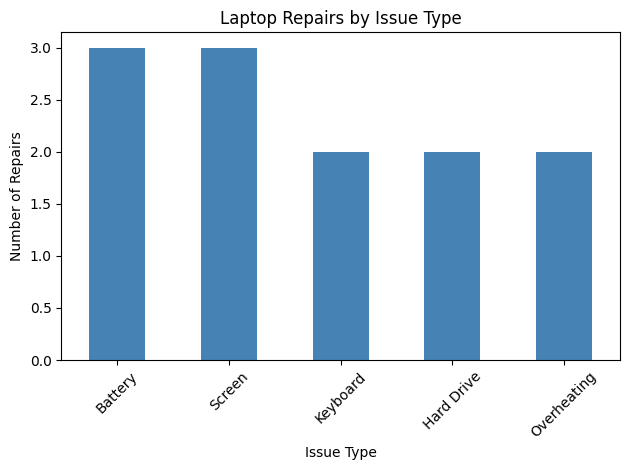
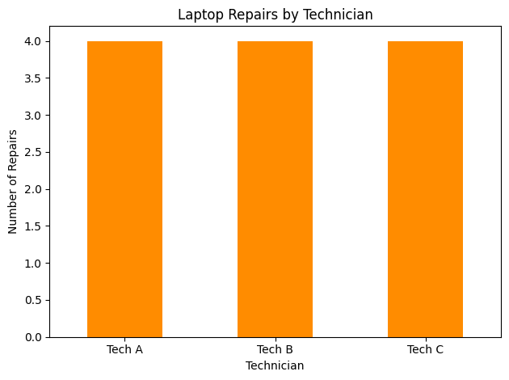

# Laptop Repair Operations Analysis

## Overview

This project analyzes a simulated laptop repair dataset to identify repair trends, common hardware issues, technician workload, and repair turnaround time.

The project demonstrates how data analytics can be applied to IT repair and operations data to identify patterns and support operational decision-making.

## Business Questions

This analysis examines:

- Which hardware issues occur most frequently?
- How many repairs are completed versus still open?
- What is the average repair turnaround time?
- How is repair volume distributed across technicians?
- What areas may benefit from operational improvement?

## Tools

- Python
- Pandas
- Matplotlib
- Google Colab

## Analysis

The project includes:

- Data preparation
- Repair volume analysis
- Issue-type analysis
- Technician workload analysis
- Repair turnaround-time calculation
- Data visualizations

## Key Metrics

The analysis calculates:

- Total repair records
- Completed repairs
- Open repairs
- Average repair time
- Repairs by issue type
- Repairs by technician

## Results

The analysis identifies patterns in hardware repair demand, technician workload, and repair turnaround time.

These results demonstrate how IT operations data can be used to monitor workload, identify recurring hardware issues, and support process improvement.

## Visualizations

### Repairs by Issue Type

### Repairs by Technician

## Business Value

Repair operations teams can use this type of analysis to:

- Monitor repair workload
- Identify recurring hardware problems
- Evaluate turnaround time
- Understand technician workload
- Identify opportunities to improve repair processes

## Project Files

| File | Description |
|---|---|
| `Laptop_Repair_Operations_Analysis.ipynb` | Complete Python analysis and visualizations |
| `tickets_by_issue.png` | Repair volume by issue type |
| `tickets_by_technician.png` | Repair volume by technician |
| `README.md` | Project documentation |

## Note

The dataset used in this project is simulated and created for portfolio and demonstration purposes.
